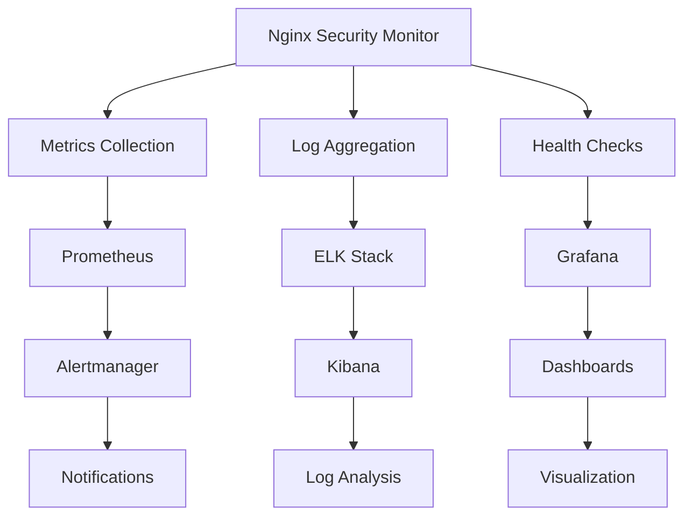

# Monitoring and Logging Guide

This comprehensive guide covers monitoring, logging, and observability for Nginx Security Monitor,
including metrics collection, alerting, and log analysis.

## Overview

Effective monitoring of Nginx Security Monitor involves tracking:

- **System Health**: Service status, resource utilization, and performance
- **Security Metrics**: Threat detection rates, false positives, and response times
- **Operational Metrics**: Log processing rates, integration status, and uptime
- **Business Metrics**: Security events blocked, compliance status, and ROI

## Monitoring Architecture



## Metrics Collection

### Prometheus Configuration

```yaml
# monitoring/prometheus.yml
global:
  scrape_interval: 15s
  evaluation_interval: 15s

rule_files:
  - "nginx_security_monitor_rules.yml"

scrape_configs:
  - job_name: 'nginx-security-monitor'
    static_configs:
      - targets: ['localhost:8080']
    metrics_path: '/metrics'
    scrape_interval: 10s
    
  - job_name: 'nginx-security-monitor-node'
    static_configs:
      - targets: ['localhost:9100']
    scrape_interval: 15s

alerting:
  alertmanagers:
    - static_configs:
        - targets:
          - alertmanager:9093
```

### Application Metrics

```python
# src/nginx_security_monitor/monitoring/metrics.py
from prometheus_client import Counter, Histogram, Gauge, start_http_server
import time

# Metrics definitions
log_entries_processed = Counter(
    'nsm_log_entries_processed_total',
    'Total number of log entries processed',
    ['source', 'status']
)

threat_detections = Counter(
    'nsm_threat_detections_total',
    'Total number of threats detected',
    ['threat_type', 'severity', 'action']
)

processing_time = Histogram(
    'nsm_processing_time_seconds',
    'Time spent processing log entries',
    ['operation']
)

active_integrations = Gauge(
    'nsm_active_integrations',
    'Number of active integrations',
    ['integration_type']
)

memory_usage = Gauge(
    'nsm_memory_usage_bytes',
    'Memory usage in bytes',
    ['component']
)

response_time = Histogram(
    'nsm_response_time_seconds',
    'Response time for various operations',
    ['endpoint', 'method']
)

# Metrics collection functions
def record_log_processing(source, status, processing_time_seconds):
    log_entries_processed.labels(source=source, status=status).inc()
    processing_time.labels(operation='log_processing').observe(processing_time_seconds)

def record_threat_detection(threat_type, severity, action):
    threat_detections.labels(
        threat_type=threat_type,
        severity=severity,
        action=action
    ).inc()

def update_integration_status(integration_type, active_count):
    active_integrations.labels(integration_type=integration_type).set(active_count)
```

### System Metrics

```yaml
# monitoring/node_exporter.yml
# Node Exporter configuration for system metrics
collectors:
  - cpu
  - diskstats
  - filesystem
  - loadavg
  - meminfo
  - netdev
  - netstat
  - stat
  - time
  - uname
  - vmstat

filesystem:
  ignored-mount-points: "^/(dev|proc|sys|var/lib/docker/.+)($|/)"
  ignored-fs-types: "^(autofs|binfmt_misc|cgroup|configfs|debugfs|devpts|devtmpfs|fusectl|hugetlbfs|mqueue|overlay|proc|procfs|pstore|rpc_pipefs|securityfs|sysfs|tracefs)$"
```

## Alerting Rules

### Prometheus Alert Rules

<!-- markdownlint-disable MD013 -->

```yaml
# monitoring/nginx_security_monitor_rules.yml
groups:
  - name: nginx_security_monitor
    rules:
      # Service Health Alerts
      - alert: NSMServiceDown
        expr: up{job="nginx-security-monitor"} == 0
        for: 1m
        labels:
          severity: critical
        annotations:
          summary: "Nginx Security Monitor service is down"
          description: "The Nginx Security Monitor service has been down for more than 1 minute"

      # Performance Alerts
      - alert: NSMHighProcessingTime
        expr: rate(nsm_processing_time_seconds_sum[5m]) / rate(nsm_processing_time_seconds_count[5m]) > 1.0
        for: 5m
        labels:
          severity: warning
        annotations:
          summary: "High processing time detected"
          description: "Average processing time is {{ $value }}s (threshold: 1.0s)"

      - alert: NSMHighMemoryUsage
        expr: nsm_memory_usage_bytes > 1073741824  # 1GB
        for: 10m
        labels:
          severity: warning
        annotations:
          summary: "High memory usage"
          description: "Memory usage is {{ $value | humanizeBytes }} (threshold: 1GB)"

      # Security Alerts
      - alert: NSMHighThreatRate
        expr: rate(nsm_threat_detections_total[1m]) > 10
        for: 2m
        labels:
          severity: high
        annotations:
          summary: "High threat detection rate"
          description: "Detecting {{ $value }} threats per second (threshold: 10/s)"

      - alert: NSMCriticalThreatDetected
        expr: increase(nsm_threat_detections_total{severity="critical"}[1m]) > 0
        for: 0m
        labels:
          severity: critical
        annotations:
          summary: "Critical threat detected"
          description: "{{ $value }} critical threats detected in the last minute"

      # Integration Alerts
      - alert: NSMIntegrationDown
        expr: nsm_active_integrations == 0
        for: 5m
        labels:
          severity: warning
        annotations:
          summary: "Security integration down"
          description: "No active {{ $labels.integration_type }} integrations"

      # System Resource Alerts
      - alert: NSMHighCPUUsage
        expr: 100 - (avg by(instance) (rate(node_cpu_seconds_total{mode="idle"}[5m])) * 100) > 80
        for: 10m
        labels:
          severity: warning
        annotations:
          summary: "High CPU usage"
          description: "CPU usage is {{ $value }}% (threshold: 80%)"

      - alert: NSMDiskSpaceLow
        expr: (node_filesystem_avail_bytes{mountpoint="/var/log"} / node_filesystem_size_bytes{mountpoint="/var/log"}) * 100 < 20
        for: 5m
        labels:
          severity: warning
        annotations:
          summary: "Low disk space on /var/log"
          description: "Disk space is {{ $value }}% available (threshold: 20%)"
```

<!-- markdownlint-enable MD013 -->

### Alertmanager Configuration

```yaml
# monitoring/alertmanager.yml
global:
  smtp_smarthost: 'localhost:587'
  smtp_from: 'alertmanager@example.com'

route:
  group_by: ['alertname']
  group_wait: 10s
  group_interval: 10s
  repeat_interval: 1h
  receiver: 'web.hook'
  routes:
    - match:
        severity: critical
      receiver: 'critical-alerts'
      group_wait: 0s
      repeat_interval: 5m
    - match:
        severity: high
      receiver: 'high-priority-alerts'
      repeat_interval: 15m

receivers:
  - name: 'web.hook'
    webhook_configs:
      - url: 'http://localhost:5001/webhook'

  - name: 'critical-alerts'
    email_configs:
      - to: 'security-team@example.com'
        subject: 'CRITICAL: NSM Alert - {{ .GroupLabels.alertname }}'
        body: |
          {{ range .Alerts }}
          Alert: {{ .Annotations.summary }}
          Description: {{ .Annotations.description }}
          Labels: {{ .Labels }}
          {{ end }}
    slack_configs:
      - api_url: 'YOUR_SLACK_WEBHOOK_URL'
        channel: '#security-alerts'
        title: 'Critical NSM Alert'
        text: '{{ .CommonAnnotations.summary }}'

  - name: 'high-priority-alerts'
    email_configs:
      - to: 'operations@example.com'
        subject: 'HIGH: NSM Alert - {{ .GroupLabels.alertname }}'
```

## Log Management

### Structured Logging Configuration

```yaml
# config/logging.yaml
logging:
  version: 1
  
  formatters:
    json:
      class: pythonjsonlogger.jsonlogger.JsonFormatter
      format: "%(asctime)s %(name)s %(levelname)s %(message)s"
      
    detailed:
      format: "%(asctime)s - %(name)s - %(levelname)s - %(funcName)s:%(lineno)d - %(message)s"
      
  handlers:
    console:
      class: logging.StreamHandler
      level: INFO
      formatter: json
      stream: ext://sys.stdout
      
    file:
      class: logging.handlers.RotatingFileHandler
      level: DEBUG
      formatter: json
      filename: /var/log/nginx-security-monitor/app.log
      maxBytes: 104857600  # 100MB
      backupCount: 5
      
    security:
      class: logging.handlers.RotatingFileHandler
      level: INFO
      formatter: json
      filename: /var/log/nginx-security-monitor/security.log
      maxBytes: 104857600
      backupCount: 10
      
    audit:
      class: logging.handlers.RotatingFileHandler
      level: INFO
      formatter: json
      filename: /var/log/nginx-security-monitor/audit.log
      maxBytes: 52428800  # 50MB
      backupCount: 20
      
  loggers:
    nginx_security_monitor:
      level: INFO
      handlers: [console, file]
      propagate: false
      
    nginx_security_monitor.security:
      level: INFO
      handlers: [security]
      propagate: false
      
    nginx_security_monitor.audit:
      level: INFO
      handlers: [audit]
      propagate: false
      
  root:
    level: WARNING
    handlers: [console]
```

### ELK Stack Configuration

#### Elasticsearch Configuration

```yaml
# monitoring/elasticsearch.yml
cluster.name: nginx-security-monitor
node.name: nsm-es-01
path.data: /var/lib/elasticsearch
path.logs: /var/log/elasticsearch
network.host: 0.0.0.0
http.port: 9200
discovery.type: single-node

# Security settings
xpack.security.enabled: true
xpack.security.transport.ssl.enabled: true
xpack.security.http.ssl.enabled: true

# Index settings
index.number_of_shards: 1
index.number_of_replicas: 0
```

#### Logstash Configuration

```ruby
# monitoring/logstash.conf
input {
  file {
    path => "/var/log/nginx-security-monitor/*.log"
    start_position => "beginning"
    codec => "json"
    tags => ["nginx-security-monitor"]
  }
  
  file {
    path => "/var/log/nginx/access.log"
    start_position => "beginning"
    tags => ["nginx-access"]
  }
}

filter {
  if "nginx-security-monitor" in [tags] {
    mutate {
      add_field => { "[@metadata][index]" => "nsm-logs-%{+YYYY.MM.dd}" }
    }
  }
  
  if "nginx-access" in [tags] {
    grok {
      match => { 
        "message" => "%{NGINXACCESS}" 
      }
    }
    
    date {
      match => [ "timestamp", "dd/MMM/yyyy:HH:mm:ss Z" ]
    }
    
    mutate {
      add_field => { "[@metadata][index]" => "nginx-access-%{+YYYY.MM.dd}" }
    }
  }
  
  # GeoIP enrichment
  if [clientip] {
    geoip {
      source => "clientip"
      target => "geoip"
    }
  }
  
  # User agent parsing
  if [useragent] {
    useragent {
      source => "useragent"
      target => "user_agent"
    }
  }
}

output {
  elasticsearch {
    hosts => ["localhost:9200"]
    index => "%{[@metadata][index]}"
    user => "elastic"
    password => "changeme"
  }
  
  # Debug output
  stdout {
    codec => rubydebug
  }
}
```

#### Kibana Configuration

```yaml
# monitoring/kibana.yml
server.port: 5601
server.host: "0.0.0.0"
elasticsearch.hosts: ["http://localhost:9200"]
elasticsearch.username: "elastic"
elasticsearch.password: "changeme"

# Security settings
xpack.security.enabled: true
xpack.encryptedSavedObjects.encryptionKey: "a_random_string_of_at_least_32_characters"

# Index patterns
kibana.defaultAppId: "dashboard"
```

### Log Analysis Queries

#### Elasticsearch Queries

```json
// Top threat types in the last 24 hours
{
  "query": {
    "bool": {
      "must": [
        {
          "range": {
            "@timestamp": {
              "gte": "now-24h"
            }
          }
        },
        {
          "term": {
            "event_type": "threat_detected"
          }
        }
      ]
    }
  },
  "aggs": {
    "threat_types": {
      "terms": {
        "field": "threat_type.keyword",
        "size": 10
      }
    }
  }
}

// Geographic distribution of attacks
{
  "query": {
    "bool": {
      "must": [
        {
          "range": {
            "@timestamp": {
              "gte": "now-7d"
            }
          }
        },
        {
          "term": {
            "severity": "high"
          }
        }
      ]
    }
  },
  "aggs": {
    "countries": {
      "terms": {
        "field": "geoip.country_name.keyword",
        "size": 20
      }
    }
  }
}
```

## Dashboards and Visualization

### Grafana Dashboard Configuration

```json
{
  "dashboard": {
    "title": "Nginx Security Monitor Overview",
    "panels": [
      {
        "title": "Service Health",
        "type": "stat",
        "targets": [
          {
            "expr": "up{job=\"nginx-security-monitor\"}",
            "refId": "A"
          }
        ],
        "fieldConfig": {
          "defaults": {
            "color": {
              "mode": "thresholds"
            },
            "thresholds": {
              "steps": [
                {"color": "red", "value": 0},
                {"color": "green", "value": 1}
              ]
            }
          }
        }
      },
      {
        "title": "Log Processing Rate",
        "type": "graph",
        "targets": [
          {
            "expr": "rate(nsm_log_entries_processed_total[5m])",
            "refId": "A"
          }
        ]
      },
      {
        "title": "Threat Detection Rate",
        "type": "graph",
        "targets": [
          {
            "expr": "rate(nsm_threat_detections_total[5m])",
            "refId": "A"
          }
        ]
      },
      {
        "title": "Memory Usage",
        "type": "graph",
        "targets": [
          {
            "expr": "nsm_memory_usage_bytes",
            "refId": "A"
          }
        ]
      },
      {
        "title": "Top Threat Types",
        "type": "piechart",
        "targets": [
          {
            "expr": "sum by (threat_type) (nsm_threat_detections_total)",
            "refId": "A"
          }
        ]
      }
    ]
  }
}
```

### Custom Monitoring Scripts

```python
# scripts/health_monitor.py
#!/usr/bin/env python3

import requests
import sys
import json
import time
from datetime import datetime

def check_service_health():
    """Check if the NSM service is healthy"""
    try:
        response = requests.get('http://localhost:8080/health', timeout=10)
        if response.status_code == 200:
            health_data = response.json()
            if health_data.get('status') == 'healthy':
                return True, health_data
            else:
                return False, health_data
        else:
            return False, {'error': f'HTTP {response.status_code}'}
    except Exception as e:
        return False, {'error': str(e)}

def check_integrations():
    """Check integration status"""
    try:
        response = requests.get('http://localhost:8080/integrations/status', timeout=10)
        if response.status_code == 200:
            return True, response.json()
        else:
            return False, {'error': f'HTTP {response.status_code}'}
    except Exception as e:
        return False, {'error': str(e)}

def check_metrics():
    """Check if metrics are being collected"""
    try:
        response = requests.get('http://localhost:8080/metrics', timeout=10)
        if response.status_code == 200:
            metrics_text = response.text
            # Check for key metrics
            required_metrics = [
                'nsm_log_entries_processed_total',
                'nsm_threat_detections_total',
                'nsm_memory_usage_bytes'
            ]
            
            missing_metrics = []
            for metric in required_metrics:
                if metric not in metrics_text:
                    missing_metrics.append(metric)
            
            if missing_metrics:
                return False, {'missing_metrics': missing_metrics}
            else:
                return True, {'metrics_count': len(metrics_text.split('\n'))}
        else:
            return False, {'error': f'HTTP {response.status_code}'}
    except Exception as e:
        return False, {'error': str(e)}

def main():
    checks = [
        ('Service Health', check_service_health),
        ('Integration Status', check_integrations),
        ('Metrics Collection', check_metrics)
    ]
    
    results = {}
    all_passed = True
    
    for check_name, check_func in checks:
        success, data = check_func()
        results[check_name] = {
            'success': success,
            'data': data,
            'timestamp': datetime.now().isoformat()
        }
        
        if not success:
            all_passed = False
            print(f"❌ {check_name}: {data}", file=sys.stderr)
        else:
            print(f"✅ {check_name}: OK")
    
    # Output JSON for monitoring systems
    print(json.dumps(results, indent=2))
    
    # Exit with error code if any checks failed
    sys.exit(0 if all_passed else 1)

if __name__ == '__main__':
    main()
```

## Performance Monitoring

### Real-time Performance Dashboard

<!-- markdownlint-disable MD013 -->

```bash
#!/bin/bash
# scripts/performance_dashboard.sh

while true; do
    clear
    echo "=== Nginx Security Monitor Performance Dashboard ==="
    echo "Timestamp: $(date)"
    echo
    
    # Service Status
    echo "🔍 Service Status:"
    if systemctl is-active nginx-security-monitor > /dev/null; then
        echo "  ✅ Service: Running"
    else
        echo "  ❌ Service: Stopped"
    fi
    
    # Memory Usage
    echo
    echo "💾 Memory Usage:"
    ps aux | grep nginx-security-monitor | grep -v grep | awk '{print "  RSS: " $6/1024 " MB, VSZ: " $5/1024 " MB"}'
    
    # CPU Usage
    echo
    echo "⚡ CPU Usage:"
    ps aux | grep nginx-security-monitor | grep -v grep | awk '{print "  CPU: " $3 "%"}'
    
    # Log Processing Rate
    echo
    echo "📊 Log Processing (last minute):"
    if [ -f /var/log/nginx-security-monitor/app.log ]; then
        PROCESSED=$(grep "$(date '+%Y-%m-%d %H:%M')" /var/log/nginx-security-monitor/app.log | grep "processed" | wc -l)
        echo "  Processed: $PROCESSED entries"
    fi
    
    # Threat Detection
    echo
    echo "🛡️ Threat Detection (last minute):"
    if [ -f /var/log/nginx-security-monitor/security.log ]; then
        THREATS=$(grep "$(date '+%Y-%m-%d %H:%M')" /var/log/nginx-security-monitor/security.log | grep "threat_detected" | wc -l)
        echo "  Threats: $THREATS detected"
    fi
    
    # Disk Usage
    echo
    echo "💿 Disk Usage:"
    df -h /var/log/nginx-security-monitor | tail -1 | awk '{print "  Log Directory: " $3 " used, " $4 " available (" $5 " full)"}'
    
    sleep 5
done
```

<!-- markdownlint-enable MD013 -->

## Troubleshooting and Diagnostics

### Log Analysis Tools

```python
# scripts/analyze_logs.py
#!/usr/bin/env python3

import json
import argparse
from collections import defaultdict, Counter
from datetime import datetime, timedelta
import re

def analyze_security_events(log_file, time_window_hours=24):
    """Analyze security events from log file"""
    
    cutoff_time = datetime.now() - timedelta(hours=time_window_hours)
    
    threat_counts = Counter()
    severity_counts = Counter()
    source_ips = Counter()
    timeline = defaultdict(int)
    
    with open(log_file, 'r') as f:
        for line in f:
            try:
                log_entry = json.loads(line.strip())
                
                # Parse timestamp
                log_time = datetime.fromisoformat(log_entry.get('timestamp', '').replace('Z', '+00:00'))
                
                if log_time < cutoff_time:
                    continue
                
                if log_entry.get('event_type') == 'threat_detected':
                    threat_type = log_entry.get('threat_type', 'unknown')
                    severity = log_entry.get('severity', 'unknown')
                    source_ip = log_entry.get('source_ip', 'unknown')
                    
                    threat_counts[threat_type] += 1
                    severity_counts[severity] += 1
                    source_ips[source_ip] += 1
                    
                    # Hour bucket for timeline
                    hour_bucket = log_time.strftime('%Y-%m-%d %H:00')
                    timeline[hour_bucket] += 1
                    
            except (json.JSONDecodeError, ValueError) as e:
                continue
    
    return {
        'threat_types': dict(threat_counts.most_common(10)),
        'severity_distribution': dict(severity_counts),
        'top_source_ips': dict(source_ips.most_common(10)),
        'timeline': dict(sorted(timeline.items()))
    }

def main():
    parser = argparse.ArgumentParser(description='Analyze NSM security logs')
    parser.add_argument('--log-file', required=True, help='Security log file path')
    parser.add_argument('--time-window', type=int, default=24, help='Time window in hours')
    parser.add_argument('--output', choices=['json', 'text'], default='text', help='Output format')
    
    args = parser.parse_args()
    
    analysis = analyze_security_events(args.log_file, args.time_window)
    
    if args.output == 'json':
        print(json.dumps(analysis, indent=2))
    else:
        print(f"Security Event Analysis (Last {args.time_window} hours)")
        print("=" * 50)
        
        print("\nTop Threat Types:")
        for threat_type, count in analysis['threat_types'].items():
            print(f"  {threat_type}: {count}")
        
        print("\nSeverity Distribution:")
        for severity, count in analysis['severity_distribution'].items():
            print(f"  {severity}: {count}")
        
        print("\nTop Source IPs:")
        for ip, count in analysis['top_source_ips'].items():
            print(f"  {ip}: {count}")

if __name__ == '__main__':
    main()
```

______________________________________________________________________

**Related Documentation:**

- [Operations Guide](../OPERATIONS_GUIDE.md)
- [Performance Tuning](performance-tuning.md)
- [Disaster Recovery](disaster-recovery.md)
- [Troubleshooting](../TROUBLESHOOTING.md)
